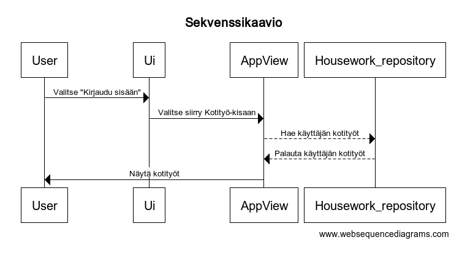

# Arkkitehtuurikuvaus

## Rakenne ja sovelluslogiikka
Sovelluksen eakennetta on hahmoteltu Pakkauskaavioon, Luokkakaavioon ja Sekvenssikaavioon.

## Toimintalogiikka ja käyttöliittymä
Sovelluksen toimintalogiikka on nähtävissä Sovelluslogiikka-nimisessä kuvassa. Sovellus käynnistyy käyttöliittymään (Ui), josta kirjautumisen (Log in) myötä päästään sovellusnäkymään (App View). Sovellusnäkymässä päästään valitsemaan sovelluksen toiminnallisuuksia, joita ovat esimerkiksi kotitöiden lisäys/muokkaus/poisto, jolle on oma näkymänsä. Myös itse Kotityö-kusalla on oma näkymänsä taulukkomuodossa. Tässä näkymässä voidaan merkata kotitöitä tehdyiksi, nähdä pistetilanne ja saadaan ylipäätään näkymä käyttöjän kotitykisasta. Jokaisesta näkymästä pääsee takaisin edelliseen näkymään ("Takaisin"), kunnes päästään kirjautumaan ulos ja kokonaan pois sovelluksesta ("Exit").

## Sovelluksen heikkoudet
Sovelluksen heikkous on käyttöliittymä, joka on yksinkertainen tekstikäyttöliittymä, jossa on toisteisuutta.

