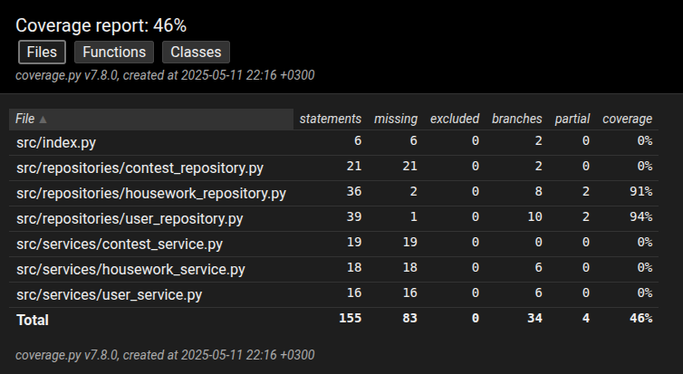

# Testausdokumentti

Ohjelmaa on testattu hyödyntäen unittestia.

## Testaus
Jokaiselle sovelluslogiikan ja repositoriolle on oma testitiedostonsa. Järjestelmätestaus on tehty manuaalisesti, seuraten sovellukselle kirjoitettua käyttöohjetta. Osa sovelluksen toiminnallisuuksista määrittelydokumentaatiosta on jäänyt testaamatta.

## Testikattavuus
Testikattavuudessa ei huomioitu käyttöliittymään liittyviä tiedostoja. Testauksen kattavuus jäi vajaaksi, haarautumakattavuus on 46%. Service-puolta ei ole testattu ollenkaan unittestilla.

